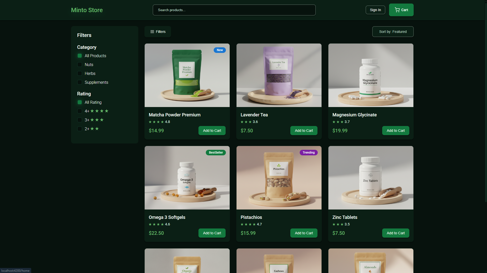

# 🛒 Major Minto Store



A modern **e-commerce web application** built with **Angular**, focused on clean architecture, real-world patterns, and junior-friendly best practices.

This project was created to simulate a real online store experience, including product listing, filtering, searching, and cart management, while applying core and advanced Angular concepts used in professional environments.

---

## ✨ Features

* Browse a list of products fetched from a mock API
* Filter products by category and other criteria
* Search products in real time
* Add and remove items from the shopping cart
* Persistent cart state during the session
* Route protection using Guards
* Lazy-loaded feature modules for better performance

---

## 🧰 Tech Stack

* **Angular** (modern standalone setup)
* **TypeScript**
* **RxJS** for async data streams
* **Angular Signals** for local and shared state management
* **Angular Router** with Lazy Loading
* **Route Guards** for access control
* **SCSS** for styling
* **Mock API** using `mock.io`

---

## 🧠 Architecture & Concepts

This project focuses on writing maintainable and readable Angular code rather than just making things work.

Key concepts applied:

* **Signals** for managing UI and application state in a predictable way
* **RxJS** for handling HTTP requests and async flows
* **Lazy Loading** to split the app into feature modules and improve initial load time
* **Guards** to control navigation and protect routes
* Clear separation of concerns between components, services, and shared logic

---

## 🚀 Getting Started

### Prerequisites

* Node.js (LTS recommended)
* Angular CLI

### Installation & Run

```bash
npm install
ng serve
```

Then open your browser at:

```
http://localhost:4200
```

---

## 🔗 Live Demo

If you would like to try the project and explore its features in action, you can access the live demo here:

🚀 **Live Demo:** https://major-minto-store.netlify.app/home

---

## 🌐 API

* The application consumes a **mock REST API** created using `mock.io`
* Used to simulate real backend behavior during development
* All product data is fetched asynchronously
* Authentication relies on the mock API when available, with an automatic **offline local auth fallback** to handle mock API instability

---

## 📚 What I Learned From This Project

* Structuring a real-world Angular application
* When to use **Signals** vs **RxJS**
* Writing reusable and maintainable services
* Improving performance with Lazy Loading
* Handling state in a clean and predictable way
* Thinking like a frontend developer working in a team environment

---

## 🔮 Future Improvements

* Add authentication and user profiles
* Improve accessibility 
* Add unit testing (Jasmine / Karma)

---

## 👨‍💻 Author

**Seif Akmal**
Front-End Developer (Angular)

* GitHub: [https://github.com/SeifAkmal](https://github.com/SeifAkmal)

---

> This project is part of my journey toward becoming a professional Front-End Developer. Feedback and suggestions are always welcome.
